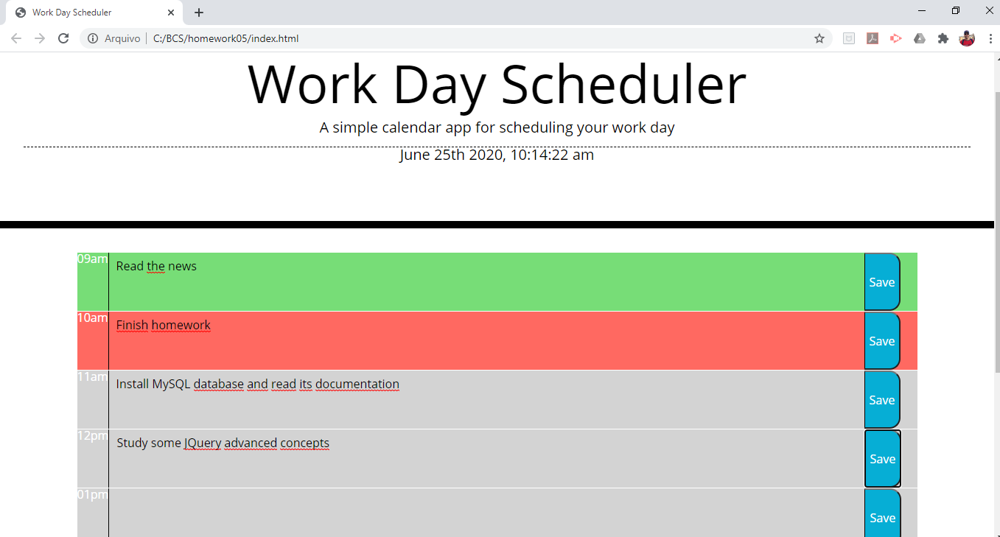

# Work Day Scheduler
Work day planner, a solution to keep track of your activities throughout the day.
Activities will be saved in local storage (Cookies).
To build this solution, a basic HTML file were use, and all the functionality was added with JQuery.

[Project Source Code](https://github.com/correaph/homework04.git)

